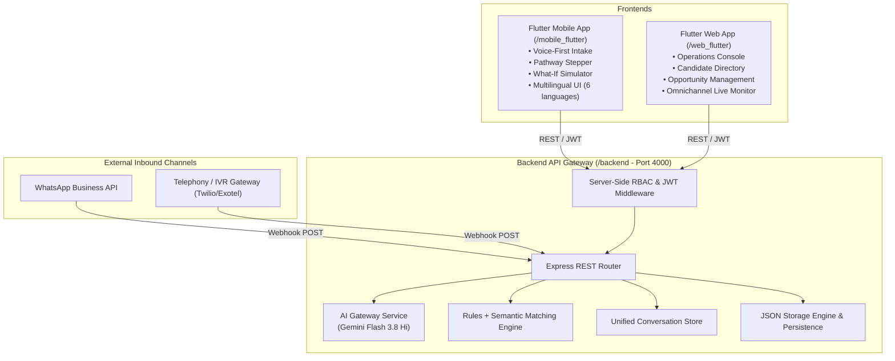

# Jeevika AI — System Architecture & Integration Specifications

## 1. High-Level Architecture Diagram

## 2. Core Architectural Principles
1. **Frontend Separation**:
   - `/mobile_flutter` is optimized for touch, voice-first interaction, offline caching, and progressive disclosure for beneficiaries.
   - `/web_flutter` is optimized for dense operational tables, filter bars, analytics funnels, drawer inspections, and webhook simulators for administrators and counselors.
2. **Server-Side Security & RBAC**:
   - Client role claims are never trusted blindly; roles are signed in JWTs and validated on every protected API endpoint (`requireRole`).
3. **AI Provider Isolation**:
   - Gemini Flash 3.8 Hi is strictly accessed through `backend/src/modules/ai/gemini.service.ts`.
   - Free-form AI responses never execute database mutations without schema verification.
   - Explicit distinction between **Verified Skills**, **Self-Declared Skills**, and **AI-Inferred Skills**.
4. **Omnichannel Conversation Convergence**:
   - Inbound WhatsApp messages, telephony voice recordings, and in-app chats all converge into a single `Conversation` entity tied to the beneficiary's profile.
